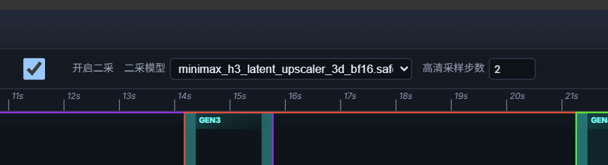

# ComfyUI MiniMax H3 时间线导演台

简体中文 · [English](README.md)

首选入口是 [**MiniMaxH3 全功能合一完全体导演台工作流**](example_workflows/MiniMaxH3全功能合一完全体导演台工作流.json)：
一套轻量工作流同时覆盖文生视频、参考图生视频、参考音频驱动、视频编辑、人物替换、动作迁移、数字人以及手动分段长视频生成，无需为不同任务更换节点图。

## 核心能力：轻量级无限时长视频生成

插件可以把任意目标时长拆成多个连续片段，在一次 ComfyUI 执行中自动完成逐段生成、
所有分段使用同一个种子、上一段 AV Latent 尾部续接、自适应 Drift-Control 视频遮罩、Soft AV 音频连续性、重叠帧去除以及最终音画合并。
只需增加分段数量即可继续延长视频，不依赖已被关闭的通用 Loop PR，也不需要在画布上
手工复制多套采样节点。实际可生成长度只受本机显存、内存、磁盘空间及 ComfyUI 单次执行能力限制。

长视频数字人可将独立音频设为**原音锁定**。插件会按时间线切分原始波形，并通过原生 AV Latent
的 mask/sigma 路径逐段注入，让人物口型继续受音频驱动，同时最终成片完整保留上传的原始音频，不重新生成或改写声音。

[下载全功能合一工作流](example_workflows/MiniMaxH3全功能合一完全体导演台工作流.json) ·
[使用说明](docs/FINITE_SEGMENT_EXPANSION_CN.md) ·
[分段提示词 Agent 规范](docs/MiniMax_H3_循环分段提示词_Agent规范.md)

[](example_workflows/MiniMaxH3全功能合一完全体导演台工作流.json)

## SelfLift 二采：75% 低清 + 25% 高清高速生成

素材规划台已经集成适用于 MiniMax H3 的 SelfLift 渐进分辨率二采。勾选 **开启二采**，选择
`ComfyUI/models/latent_upscale_models/` 中的 H3 Latent Upscaler，再填写 **高清采样步数**即可。
推荐让高清阶段约占总采样步数的 `25%`：例如总步数为 8 时设置高清采样步数为 2，实际执行
`6 步低分辨率 + Latent 放大 + 2 步高分辨率`。高清采样步数必须大于 0 且小于调度器总步数。



二采不是简单地对每段单独放大：段与段之间会同时延续上一段的原生低清 Latent 尾部和最终
高清 Latent 上下文，并在低清、高解析度两个阶段分别执行 Drift-Control。这样可以避免长视频
逐段缩放、反复编解码造成的清晰度劣化，并消除多段生成常见的模糊、闪白和可见接缝。

作者实测案例：`1536×832 / 29 秒`视频约 `10 分钟`直出，使用 `75%` 低清采样与 `25%`
高清采样；实际速度会随显卡、显存、模型、步数和参考素材复杂度变化。锁定独立音频或开启
参考视频原声后，音频进入原生 AV 零去噪锁定路径并以连续原波形作为最终主轨，实测内容与
时序保持 `99%+` 一致；最终 MP4 封装仍可能按保存节点设置重新编码音频。

同一套工作流可以完成文生视频、参考图生视频、参考音频生视频、图片加音频、参考视频编辑、
人物替换、动作迁移、数字人对口型以及无明显劣化、无可见接缝的多段长视频生成。

### 约一分钟直接生成案例

下面两段均为插件一次执行直接生成的 `52.625 秒 / 1263 帧 / 24fps` 成片。点击缩略图播放或下载原始 MP4；
视频和缩略图存放在 GitHub Release，不会增加插件克隆与安装体积。

| 案例一：有限分段 Latent 续写 | 案例二：参考素材 + 48 帧重叠续写 |
| --- | --- |
| [](https://github.com/Songssx/ComfyUI-MiniMaxH3-TimelineDirector/releases/download/v0.6.0/H3_finite_segments_60s.mp4) | [](https://github.com/Songssx/ComfyUI-MiniMaxH3-TimelineDirector/releases/download/v0.6.0/H3_reference_overlap48_60s.mp4) |

<p align="center">
  
</p>

<p align="center">
  作者：<strong>石兄松 / Shi Xiongsong</strong><br>
  <a href="https://space.bilibili.com/219572544?spm_id_from=333.40164.0.0">哔哩哔哩</a>
  ·
  <a href="https://www.youtube.com/@shixiongsong">YouTube</a>
</p>

一个为 ComfyUI 原生 **MiniMax H3 Reference to Video** 工作流设计的可视化参考素材时间线。它将参考视频、视频原声、固定 Guide、独立图片和独立音频集中到一个类似剪辑软件的界面中。

> 视频生成 Agent 请阅读：[长视频分段生成 Agent 操作规范](docs/AGENT_LONG_VIDEO_GUIDE_CN.md)

## 主要功能

- 多视频时间线：移动、裁剪、分段、删除、吸附和精确数值定位。
- 青色生成选区：只有与选区重叠的素材区间参与本次视频参考或 Guide。
- 三种视频用途：`固定Guide`、`可编辑参考`、`仅固定边界`。
- 纯文生视频：不上传任何素材且不启用分段时，素材规划台的全局提示词与当前 GEN 时长会由有限分段采样内部创建标准 H3 空 AV latent；启用手动时间框后也可生成文生长视频。
- 原声同步：视频移动和裁剪时原声保持绑定；无论一采还是二采，“视频原声”开启都会自动进入原声锁定的原生 AV 路径，并在最终输出中使用连续原波形；关闭后固定为静音，不生成替代声音。显式上传的锁定音频优先级更高。
- 低清预览：最高 `480×270 / 12fps` 无声代理，红色播放头可拖动预览。
- 独立素材箱：图片和音频支持多选、外部拖入、删除及拖拽排序；全局图片库与音频库不限制上传总数，
  每个实际生成分段仍遵循 MiniMax H3 的上限，最多使用 9 张参考图和 3 段参考音频。
- 原音锁定：支持长视频数字人和人物唱歌，按分段锁定 AV Latent，并在最终合并时保持源音频内容不变。
- 稳定编号：界面中的 `<Picture 1>`、`<Video 1>`、`<Audio 1>` 与 H3 输入顺序一致。
- 全局与分段提示词：全局提示词可复用于全部片段；任意分段提示词启用后，全局提示词自动失效且要求补全每一段。
- 显存保护：素材在解码时按节点 `width × height` 调整分辨率。
- 内置二采：每个分段可先低清采样、再通过 H3 Latent Upscaler 放大并完成高清采样；长视频会同时延续上一段原生低清尾部和高清 Drift-Control 上下文，无需安装 `comfyui-SelfLift`。
- 长视频数字人：锁定原声走原生 AV mask/sigma 路径，在分段和二采模式下保持音频内容及口型引导。
- 音频输出：可分别输出时间线视频原声合并结果和独立参考音频合并结果。
- 状态保存：时间线编辑状态会写入 ComfyUI 工作流 JSON。

## 长视频主工作流节点

| 节点 | 用途 |
| --- | --- |
| **MiniMax H3 素材规划台** | 编辑素材并输出紧凑的 `素材规划` 与 `Omni素材包`。 |
| **MiniMax H3 Omni 素材包提示词桥** | 将规划台素材送入已安装的 Prompt Rewriter Omni，并只输出 `rewritten_prompt`。 |
| **MiniMax H3 有限分段采样** | 展开普通无环执行图，完成直接 Latent 续写、时间遮罩、采样、去重和合并。 |
| **MiniMax H3 时间线导演台（兼容）** | 保留原先的一体化工作流和旧工作流兼容性。 |

长视频生成只需连接 **素材规划台「分段规划」→ 有限分段采样「有限分段规划」**。
`MiniMax H3 规划编码器`仍作为内部执行节点注册，以便采样器展开执行图和兼容旧工作流，但不会在新建节点菜单中显示。

拆分节点可以避免“素材输出连接到前置提示词重写器，再返回同一编码节点”产生的循环：

```text
素材规划台 ──Omni素材包──> Omni提示词桥 ──rewritten_prompt──> 规划编码器
     └────────────────素材规划──────────────────────────────> 规划编码器
```

## 安装

```bash
cd ComfyUI/custom_nodes
git clone https://github.com/Songssx/ComfyUI-MiniMaxH3-TimelineDirector.git
```

重启 ComfyUI 后，搜索 `MiniMax H3` 即可找到节点。

二采运行模块已经内置在本插件中，不需要另外安装 `comfyui-SelfLift`。开启二采仍需自行把兼容的 MiniMax H3 Latent Upscaler 模型放入 `ComfyUI/models/latent_upscale_models/`，素材规划台会自动列出该目录中的模型。

插件以英文作为基础 UI，并通过 ComfyUI 官方本地化机制提供简体中文。它会跟随 ComfyUI
设置中选择的界面语言；切换语言后请刷新前端或重启 ComfyUI。

### 环境要求

- 较新的 ComfyUI，包含原生 MiniMax H3 节点；使用固定 Guide 时还需 `MiniMaxH3AddGuide`。
- MiniMax H3 Ref2VA 对应模型、CLIP、视频 VAE 和音频 VAE。
- Python 3.10 或更高版本。
- 低清代理依赖 ComfyUI 环境中的 `imageio-ffmpeg`。

插件不额外声明 pip 依赖，使用兼容 ComfyUI 通常已经包含的 PyAV、Pillow、NumPy、PyTorch、torchaudio、aiohttp 和 imageio-ffmpeg。

## 示例工作流

仓库只保留下面两个示例。第一个是日常生成入口，第二个用于需要 Omni 自动扩写提示词的场景。

### 1. 全功能合一完全体导演台（推荐）

[下载工作流](example_workflows/MiniMaxH3全功能合一完全体导演台工作流.json)

这是一套 **全任务、轻量级、无需换图** 的主工作流，仅通过素材规划台的素材、时间框和提示词配置，即可完成：

- 无素材单段文生视频。
- 无素材多段文生长视频。
- 图片参考单段生成。
- 图片参考多段生成。
- 图片 + 音频单段参考生成。
- 图片 + 音频多段参考生成及数字人对口型。
- 视频单段可编辑参考、人物替换和动作迁移。
- 长视频手动分段参考生成、人物替换、动作迁移及最终音画合并。

素材规划台的 **分段规划** 直接连接 **MiniMax H3 有限分段采样**。未上传素材时会建立空 AV Latent；上传素材后则按每段分配关系编码参考。用户可以拖动 GEN 时间框定义各段长度与接缝重叠，使用全局提示词复用同一要求，也可以为每段填写独立提示词。插件负责合法帧数对齐、Drift-Control、Soft AV、重叠去除、尾部裁剪和最终合并。

> 插件不会按参考媒体时长自动分段，也不会替用户判断角色是否应当续接。分段范围、相邻段重叠和每段素材均由时间线配置决定；人物替换通常应把原视频设为 `可编辑参考`。

### 2. 时间规划 + Prompt 提示词生成

[下载工作流](example_workflows/MiniMax_H3时间规划+Prompt提示词生成.json)

在素材规划台基础上加入 **MiniMax H3 Omni 素材包提示词桥**，让 Prompt Rewriter Omni 同时读取有序图片、视频和音频，为当前任务扩写 H3 提示词。适合先由多模态模型理解素材，再进入 H3 生成的工作方式。

> 使用该工作流前必须安装 [MiniMax-H3-Prompt-Rewriter-ComfyUI](https://github.com/pytraveler/MiniMax-H3-Prompt-Rewriter-ComfyUI)。模型、量化方式及显存要求请参考该项目说明。

## 基本使用方法

1. 设置 `width`、`height` 和 `generation_seconds`。
2. 用 `+ 视频`、`+ 图片`、`+ 音频` 添加素材；也可以把文件直接拖入控件。
3. 移动、裁剪或分段视频，并把青色选区放到本次需要生成的区间。
4. 为每段视频选择用途：
   - `固定Guide`：重叠部分按生成时间位置固定，适合续写和保持运动。
   - `可编辑参考`：只作为 `<Video N>` 参考，不硬锁原人物，适合人物或风格替换。
   - `仅固定边界`：仅固定重叠区首尾帧。
5. 按需设置“视频原声”：开启即在一采和二采中锁定原音，关闭即静音输出。
6. 检查底部提示词编号，再连接对应编码或提示词工作流运行。

视频编号按照青色选区内重叠片段在时间线上的从左到右顺序生成。独立图片和独立音频按素材箱显示顺序生成编号，拖拽排序后会同步更新底层输入顺序。

## 长视频分段

推荐分段生成并保留短重叠区：下一段使用上一段末尾镜头作为开头 Guide，提示词中的 `Shot 1` 必须先描述这段重叠参考，再描述新内容。合并时删除后一段重复的固定 Guide 区域。完整规则见 [Agent 操作规范](docs/AGENT_LONG_VIDEO_GUIDE_CN.md)。

### 有限分段直接 Latent 续写

有限分段采样会把上一段 sampled AV Latent 的尾部直接放到下一段开头，避开
`RGB Decode → VAE Encode` 往返。有限分段采样固定使用 Drift-Control，不再提供续接模式
选项。用户填写的重叠帧会向下对齐到 H3 合法时间网格，例如24变成22、48变成39；Latent
续接、解码后裁剪和最终合并始终使用同一个实际重叠值。视频遮罩会同时适配实际重叠对应的
Latent 时间步数量和外部采样器的真实 sigma 调度，可用于加速模型常用的4步、8步以及常规20步：仅对临时视频前缀按采样步动态匹配噪声，保持接缝侧 latent 干净；开启音频
续接时，重叠音频前部保持完全保护，最后8个音频 latent tick 使用半余弦 Soft AV 遮罩逐渐
释放到新生成声音。合并时由后一段的 Soft AV 重叠音频替换前一段末尾，因此渐变会保留在
最终音轨中。所有分段始终使用采样节点设置的同一个种子。旧的
`循环分段提示词`、`Latent 循环续段`、`循环片段去重`以及对 PR #15923 的依赖已经移除。

Drift-Control AV 基于 GPL-3.0 项目
[ComfyUI-MiniMaxH3-Contex-Loop](https://github.com/ethanfel/ComfyUI-MiniMaxH3-Contex-Loop)
的实验实现进行适配，目前仅建议用于同镜头长链对照测试。

## 致谢与参考

- 特别感谢 [facok/comfyui-SelfLift](https://github.com/facok/comfyui-SelfLift) 提供的 SelfLift 渐进分辨率二采技术。本插件在其思路和实现基础上针对 MiniMax H3 AV Latent、原生音频 mask/sigma、低清/高清长视频续接及接缝处理进行了深度适配，并将运行模块内置到插件中。
- MiniMax H3 学习型 Latent Upscaler 的结构兼容参考了 [LBH-123-AI/Comfyui_Minimax_h3_latent_Upscaler](https://github.com/LBH-123-AI/Comfyui_Minimax_h3_latent_Upscaler)。
- 本项目的 Omni 提示词桥及提示词工作流参考并适配了 [pytraveler/MiniMax-H3-Prompt-Rewriter-ComfyUI](https://github.com/pytraveler/MiniMax-H3-Prompt-Rewriter-ComfyUI)。
- MiniMax H3 提示词结构与模型使用方式请参考 [MiniMax-AI/MiniMax-H3](https://github.com/MiniMax-AI/MiniMax-H3)。
- 感谢 ComfyUI 原生 MiniMax H3 与 Guide 节点的维护者。

## 许可

[GPL-3.0](LICENSE)
